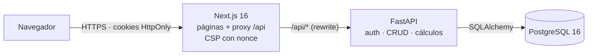

# Cuenta Clara

[](https://github.com/itssmauu/cuenta-clara/actions/workflows/ci.yml)

Aplicación web de finanzas personales: registra tu monto inicial, tus gastos fijos y tus ingresos, y descubre cuánto te queda **antes** de gastarlo.

Proyecto personal de portafolio: backend en FastAPI, frontend en Next.js, PostgreSQL, Docker y CI completo, con la seguridad como requisito central.


| Landing | Registro | Predicción | Móvil |
| --- | --- | --- | --- |
|  |  |  |  |

## ¿Qué hace?

1. Te registras e indicas tu **monto inicial**.
2. Añades tus **gastos fijos** (internet, datos móviles, pasaje…).
3. Indicas cuánto **ingresas** y con qué frecuencia (diario, semanal, quincenal, mensual o personalizado).
4. La app te muestra tu saldo, una **proyección por periodo** y si vas dentro o por encima de tu **límite de gasto**.

Ejemplo: monto inicial $100, gasto semanal $30 → quedan $70. Si ese periodo ingresan $160 → saldo proyectado **$230**.

### Funcionalidades

- **Onboarding de 4 pasos:** monto inicial → gastos fijos → ingreso y frecuencia → límite de gasto.
- **Dashboard:** saldo, ingresos y gasto del periodo (diario, semanal, quincenal o mensual); gráfica de gasto contra límite que marca en coral los periodos en que te pasaste; próximos gastos fijos; gastos del periodo.
- **Ingresos y gastos fijos recurrentes**, que se suman y restan solos en sus fechas. Se pueden pausar sin borrarlos.
- **Movimientos** sueltos con filtros por fecha, tipo y categoría.
- **Predicción** del saldo para los próximos 4, 8 o 12 periodos.
- **Configuración:** monto inicial, moneda, periodo, límite y categorías propias.

## Stack

| Capa | Tecnología |
| --- | --- |
| Frontend | Next.js (App Router), TypeScript, Tailwind CSS, React Hook Form + Zod, Recharts |
| Backend | Python 3.12, FastAPI, SQLAlchemy 2.x, Alembic, Pydantic v2 |
| Base de datos | PostgreSQL 16 |
| Infra local | Docker Compose |
| Calidad | pytest, Vitest + Testing Library, Playwright + axe-core, ruff, ESLint + Prettier, GitHub Actions |

## Arquitectura



El navegador solo habla con la app web; Next.js reenvía `/api/*` a FastAPI, así que las cookies de sesión son del mismo origen. Detalle por capas, flujo de autenticación y modelo de datos en [`docs/architecture.md`](docs/architecture.md).

## Cómo correrlo

Requisitos: [Docker Desktop](https://www.docker.com/products/docker-desktop/) y Git.

```bash
git clone https://github.com/itssmauu/cuenta-clara.git
cd cuenta-clara
cp .env.example .env   # edita los valores
docker compose up -d --build
```

Esto levanta PostgreSQL 16, la API (que aplica las migraciones al arrancar) y el frontend:

- App web: <http://localhost:3000>
- API: <http://localhost:8000/api/v1/health>
- Documentación interactiva (Swagger): <http://localhost:8000/docs>

Para trabajar sin Docker, ver [`backend/README.md`](backend/README.md) y [`frontend/README.md`](frontend/README.md).

> **¿Ya tienes PostgreSQL instalado en tu máquina?** Ocupa el puerto 5432. Cambia `POSTGRES_PORT=5433` en `.env` (y el puerto en `DATABASE_URL` / `TEST_DATABASE_URL`).

## Variables de entorno

Definidas en [`.env.example`](.env.example). Nunca se commitea `.env`.

| Variable | Descripción |
| --- | --- |
| `POSTGRES_USER` | Usuario de la base de datos |
| `POSTGRES_PASSWORD` | Contraseña de la base de datos |
| `POSTGRES_DB` | Nombre de la base de datos |
| `POSTGRES_PORT` | Puerto del host (solo `127.0.0.1`), por defecto `5432` |
| `APP_ENV` | `development`, `test` o `production` (en producción se desactiva `/docs`) |
| `LOG_LEVEL` | `DEBUG`, `INFO`, `WARNING` o `ERROR` |
| `BACKEND_PORT` | Puerto del host para la API, por defecto `8000` |
| `DATABASE_URL` | Conexión de la API cuando corre fuera de Docker |
| `TEST_DATABASE_URL` | Base **desechable** para los tests (se borra en cada corrida) |
| `JWT_SECRET_KEY` | Clave para firmar los tokens (≥ 32 caracteres aleatorios) |
| `ACCESS_TOKEN_TTL_MINUTES` / `REFRESH_TOKEN_TTL_DAYS` | Duración de la sesión (15 min / 7 días) |
| `COOKIE_SECURE` | Cookies solo por HTTPS; obligatorio `true` en producción |
| `LOGIN_RATE_LIMIT` / `REGISTER_RATE_LIMIT` / `EMAIL_RATE_LIMIT` | Límites por IP y por correo |
| `MAX_FAILED_LOGINS` / `LOCKOUT_MINUTES` | Bloqueo temporal tras intentos fallidos |
| `FRONTEND_ORIGIN` | Único origen permitido por CORS |
| `FORWARDED_ALLOW_IPS` | IPs de proxy en las que la API confía para `X-Forwarded-For` |
| `FRONTEND_PORT` | Puerto del host para la app web, por defecto `3000` |
| `API_INTERNAL_URL` | A dónde reenvía Next.js las peticiones `/api/*` |

## Estructura

```
cuenta-clara/
├─ backend/            # API FastAPI
├─ frontend/           # App Next.js
├─ infra/              # scripts de infraestructura (init de Postgres)
├─ docs/               # arquitectura, decisiones, seguridad, cálculos, pruebas, capturas
├─ .github/workflows/  # CI
├─ docker-compose.yml
└─ .env.example
```

## Roadmap

- [x] **Fase 0:** base del repo, Docker Compose con Postgres, CI
- [x] **Fase 1:** backend núcleo (config, BD, modelos, migraciones, salud)
- [x] **Fase 2:** autenticación segura (Argon2id, JWT + refresh rotativo, rate limiting)
- [x] **Fase 3:** datos financieros (ajustes, ingresos, gastos fijos, transacciones, categorías)
- [x] **Fase 4:** dashboard y predicción
- [x] **Fase 5:** frontend base (tokens de diseño, landing, login/registro)
- [x] **Fase 6:** onboarding y dashboard
- [x] **Fase 7:** resto de pantallas
- [x] **Fase 8:** pulido, accesibilidad, E2E y documentación
- [ ] **Fase 9** (ideas, pendientes de aprobación): metas de ahorro, alertas al 80 % del límite, comparación con el periodo anterior, gráfico por categoría, exportar a CSV, predicción con aprendizaje automático

## Calidad y pruebas

Cada push a `main` y cada PR pasan por CI: lint, tipos, pruebas, build, auditoría de dependencias y el stack completo en Docker con pruebas end-to-end.

| Nivel | Herramienta | Qué cubre |
| --- | --- | --- |
| Backend | pytest | Cálculos (incluido 100 − 30 + 160 = 230), API, seguridad (tokens falsificados, CSRF, rate limiting, bloqueo) y anti-IDOR por recurso |
| Frontend | Vitest + Testing Library | Validaciones, cliente de API, formularios, dashboard y cada pantalla |
| End-to-end | Playwright | Registro → onboarding → dashboard → movimientos → cerrar sesión, contra el stack real |
| Accesibilidad | axe-core | Auditoría WCAG 2.2 AA de **todas** las pantallas, sin violaciones |

Cómo correr cada nivel: [`docs/testing.md`](docs/testing.md).

## Documentación

| Documento | Contenido |
| --- | --- |
| [`docs/architecture.md`](docs/architecture.md) | Capas, flujo de una petición, autenticación y modelo de datos |
| [`docs/security.md`](docs/security.md) | Cada medida de seguridad, dónde está y qué test la cubre |
| [`docs/calculations.md`](docs/calculations.md) | Cómo se calculan el saldo, el límite y la predicción |
| [`docs/testing.md`](docs/testing.md) | Estrategia de pruebas y cómo ejecutarlas |
| [`docs/decisions.md`](docs/decisions.md) | Registro de decisiones con su porqué |

## Seguridad

La app maneja información financiera, así que la seguridad es un requisito central: Argon2id, sesiones en cookies `HttpOnly` con refresh rotativo y detección de robo, CSRF, rate limiting, bloqueo temporal y errores que no revelan qué correos existen. Detalle completo, con dónde está implementada cada medida y qué test la cubre, en [`docs/security.md`](docs/security.md).

Cómo se calculan el saldo, el límite de gasto y la predicción: [`docs/calculations.md`](docs/calculations.md).
