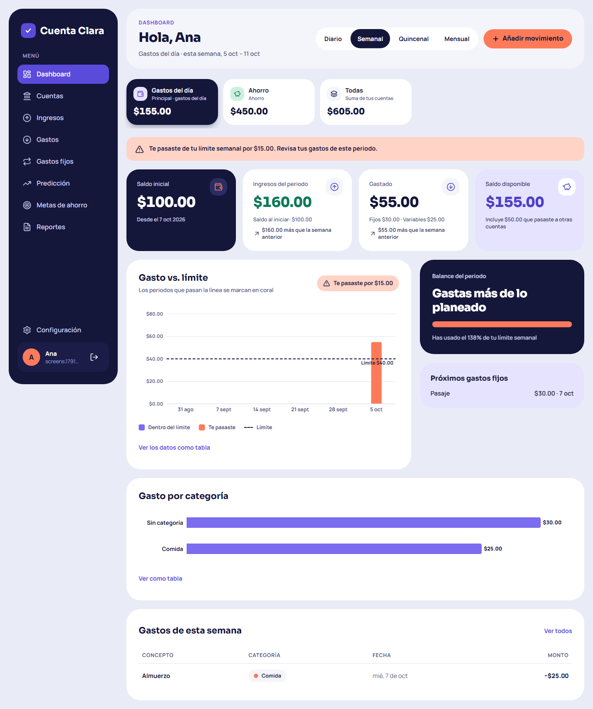
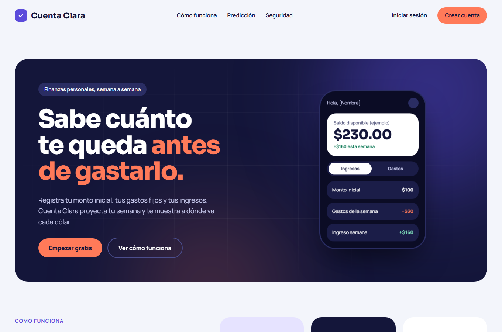
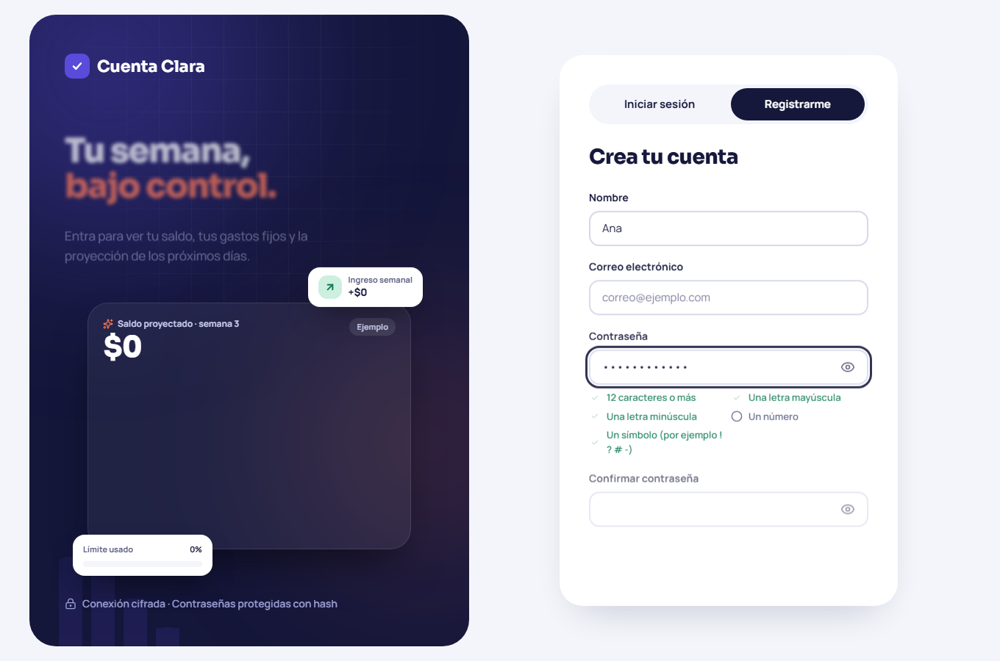
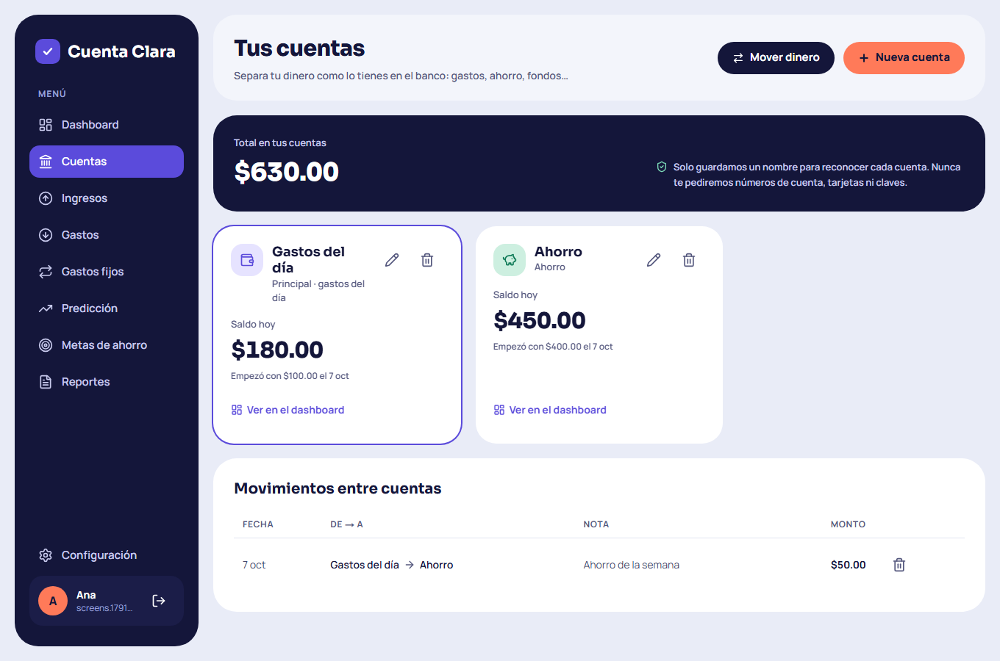
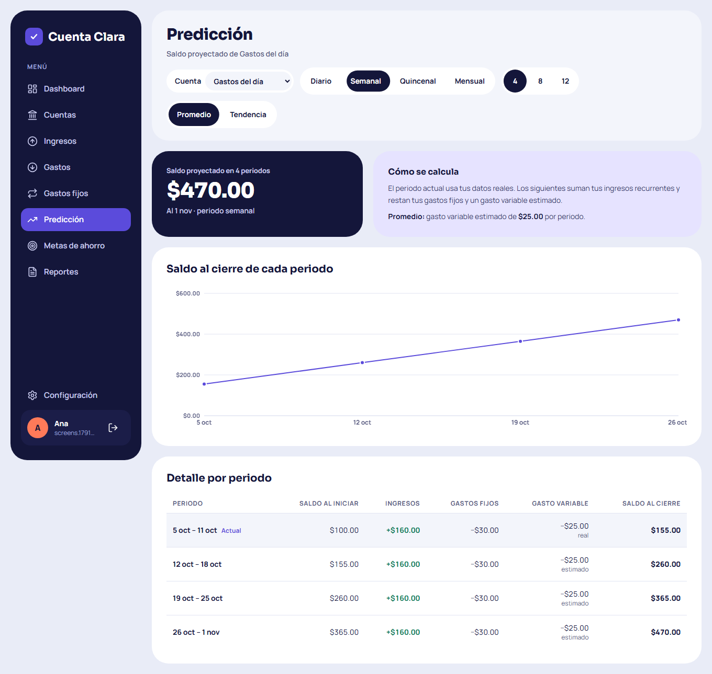
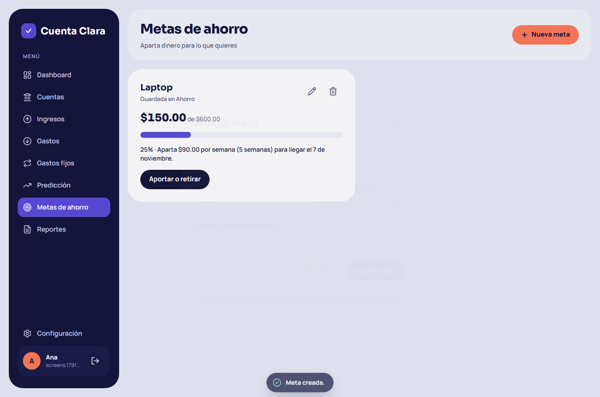
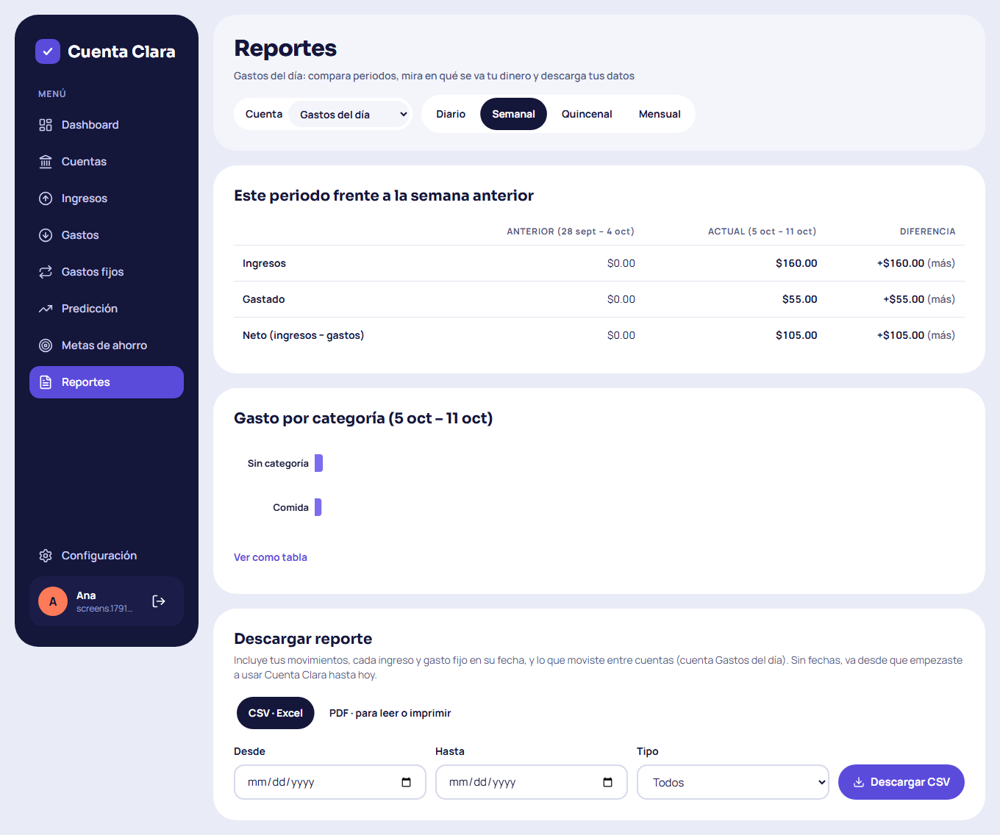
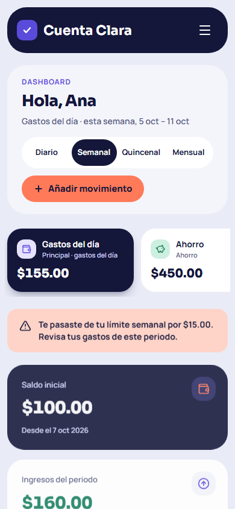

# Cuenta Clara

**Sabe cuánto te queda antes de gastarlo.**

Cuenta Clara es una aplicación web de finanzas personales. Registras con cuánto dinero cuentas, tus gastos fijos y tus ingresos, y la app te muestra tu saldo, a dónde va tu dinero y cuánto te quedará en las próximas semanas, antes de que llegue el momento de gastarlo.

Es un proyecto personal de portafolio, hecho con cuidado en el diseño, la accesibilidad y la seguridad.

## De qué trata

Mucha gente sabe cuánto tiene hoy, pero no cuánto le quedará al final de la semana o del mes. Cuenta Clara hace esas cuentas por ti:

1. Indicas tus **cuentas** (la de gastos del día, la de ahorro, la de fondos…) y cuánto tiene cada una.
2. Añades tus **gastos fijos**: internet, datos, pasaje…
3. Indicas cuánto **ingresas** y cada cuánto: diario, semanal, quincenal, mensual o a tu medida.
4. La app te muestra tu saldo, una **proyección por periodo** y si vas dentro o por encima de tu **límite de gasto**.

> Si tienes $100 y gastas $30, te quedan $70. Si esa semana recibes $160, tu saldo proyectado es **$230**.

## Qué tiene

- **Página de inicio** que explica la app, con animaciones y demos interactivas.
- **Registro e inicio de sesión** con una proyección animada y requisitos de contraseña en vivo.
- **Onboarding** guiado: tus cuentas, gastos fijos, ingresos y límite.
- **Dashboard:**
  - tu saldo, lo que ingresaste y lo que gastaste en el periodo;
  - la gráfica de gasto contra tu límite;
  - el gasto por categoría y los próximos pagos.
- **Varias cuentas:** gastos del día, ahorro, fondos… cada una con su saldo, y puedes **mover dinero** entre ellas sin que cuente como gasto.
- **Ingresos y gastos fijos** que se registran solos en sus fechas, y que puedes pausar.
- **Movimientos** sueltos, con filtros.
- **Predicción** de tu saldo para las próximas semanas o meses, con promedio o tendencia.
- **Metas de ahorro** que te dicen cuánto apartar por periodo para llegar a tiempo.
- **Alertas** al acercarte a tu límite y **comparación** con el periodo anterior.
- **Reportes** descargables en **CSV o PDF**.
- Pensada para **celular y escritorio**, accesible con teclado y lector de pantalla.

## Capturas

| Inicio | Registro | Cuentas |
| --- | --- | --- |
|  |  |  |

| Predicción | Metas de ahorro | Reportes |
| --- | --- | --- |
|  |  |  |

  

## Privacidad y seguridad

Tus finanzas son solo tuyas:

- Las contraseñas se guardan cifradas.
- Las sesiones son seguras.
- Nadie más puede ver tus datos.
- La app **nunca te pide números de cuenta, tarjetas ni claves bancarias**: tus cuentas se reconocen solo por un nombre que tú eliges.

## Hecho con

Next.js · TypeScript · Tailwind CSS · Python · FastAPI · PostgreSQL · Docker

---

Proyecto personal de portafolio.
