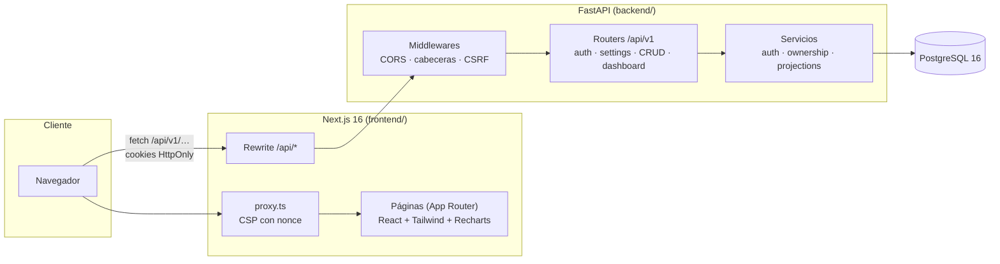
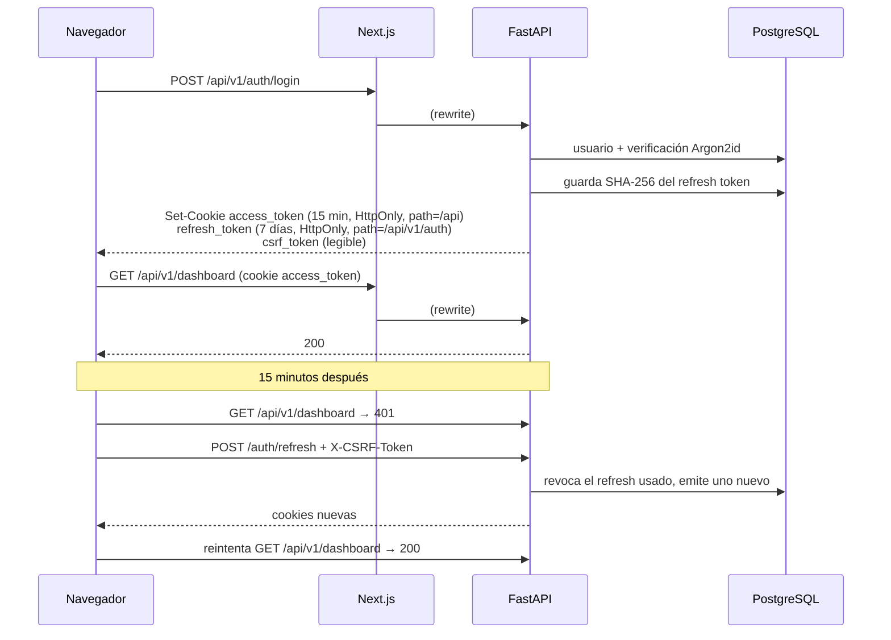
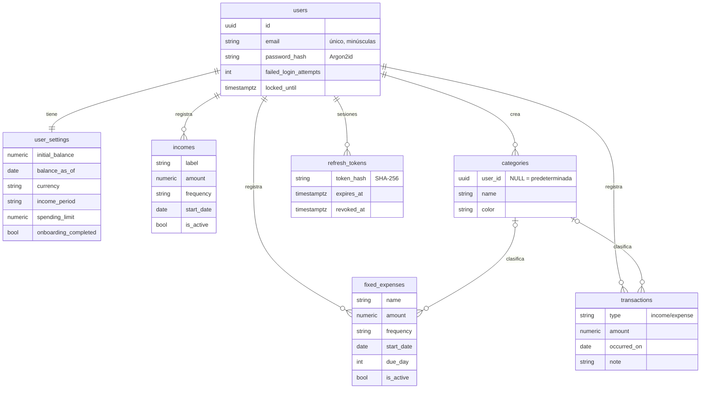

# Arquitectura

## Vista general

- **Un solo origen para el navegador.**
  - El navegador nunca habla directamente con FastAPI: Next.js reenvía `/api/*` (D-032).
  - Gracias a eso las cookies de sesión son de primera parte, no hace falta CORS en el navegador y en producción basta un dominio.
- **Datos en el cliente.**
  - Las cookies de sesión tienen `path=/api`, así que las páginas privadas piden sus datos desde el navegador (D-038, D-039).
  - El servidor de Next solo entrega HTML, cada página con su nonce de CSP.

## Backend por capas

| Capa | Carpeta | Responsabilidad |
| --- | --- | --- |
| HTTP | `app/api/` | Routers, cookies, dependencia de usuario actual. Sin lógica de negocio |
| Esquemas | `app/schemas/` | Validación de entrada/salida con Pydantic (`extra="forbid"`) |
| Servicios | `app/services/` | Reglas de negocio: autenticación, acceso por dueño (anti-IDOR), cálculos |
| Cálculos | `app/services/periods.py`, `projections.py` | **Funciones puras**, sin BD ni reloj: periodos, repeticiones, saldo, límite, predicción |
| Datos | `app/models/` + `alembic/` | Modelos SQLAlchemy y migraciones; invariantes también como `CHECK` en la BD |
| Núcleo | `app/core/` | Configuración, seguridad (hash, JWT), CSRF, cabeceras, rate limiting |

Que los cálculos sean funciones puras permite probarlos con tests unitarios rápidos y explicarlos en [`calculations.md`](calculations.md) sin hablar de la base de datos.

## Frontend

| Carpeta | Responsabilidad |
| --- | --- |
| `src/app/` | Rutas: públicas, `(auth)` (login/registro), `(app)` (privadas con barra lateral), `onboarding` |
| `src/components/` | `landing/`, `auth/`, `app/` (sesión, barra lateral), `dashboard/`, `finance/` (pantallas), `onboarding/`, `ui/` (primitivas) |
| `src/lib/` | Cliente de API tipado (CSRF y refresh automático), validaciones Zod, formato de dinero y fechas |
| `src/proxy.ts` | CSP con nonce por petición |
| `e2e/` | Pruebas end-to-end y auditoría de accesibilidad |

## Autenticación

Si se reutiliza un refresh token ya rotado, el backend asume robo y revoca todas las sesiones del usuario. Detalle en [`security.md`](security.md).

## Modelo de datos

- Todos los montos son `NUMERIC(12,2)`. Todas las tablas usan `id` UUID con `created_at` y `updated_at`.
- Borrar un usuario borra sus datos en cascada. Borrar una categoría deja sus movimientos sin categoría (`ON DELETE SET NULL`).

## Infraestructura

- **Docker Compose:** `db` (Postgres 16), `backend` (aplica las migraciones al arrancar) y `frontend` (Next standalone). Los tres corren sin root y con healthchecks.
- **CI (GitHub Actions)**, tres jobs:
  - **backend:** ruff, pytest contra Postgres 16 y pip-audit.
  - **frontend:** ESLint, Prettier, tsc, Vitest, build y npm audit.
  - **infra:** compose completo, smoke tests y Playwright + axe contra ese stack.
